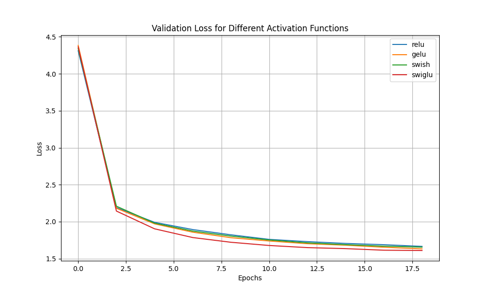

# Transformer Activation Functions Comparision

This repository contains a PyTorch implementation of a character-level Transformer language model built entirely from scratch. The primary goal of this research project is to empirically compare the training efficiency and convergence of different activation functions within the Feed-Forward Network (FFN) sub-layer.

The model is trained autoregressively on a text corpus to predict the next token. To ensure a scientifically fair comparison, parameter parity is strictly enforced across all tested architectures so that no model has a computational advantage:
* **Standard FFNs (ReLU, GELU, Swish):** Utilize an standard hidden dimension expansion factor of 4.
* **GLU Variants (SwiGLU):** Utilize three weight matrices instead of two. To perfectly match the total parameter count and FLOPs of the standard models, the hidden dimension expansion factor is scaled down to 8/3.

These are the activation functions used:

* **ReLU** (Rectified Linear Unit)
* **GELU** (Gaussian Error Linear Unit)
* **Swish / SiLU** (Sigmoid Linear Unit)
* **SwiGLU** (Swish-Gated Linear Unit)

## Results
Models were evaluated based on their validation loss over identical training durations. The findings indicate:
1. **SwiGLU** is the optimal choice among the tested functions. It converges the fastest and achieves the lowest overall validation loss.
2. **Swish** and **GELU** perform almost identically, both outperforming ReLU but falling short of SwiGLU.
3. **ReLU** consistently yields the highest validation loss, highlighting the limitations of simple zero-cutoff functions in modern Transformer architectures.

